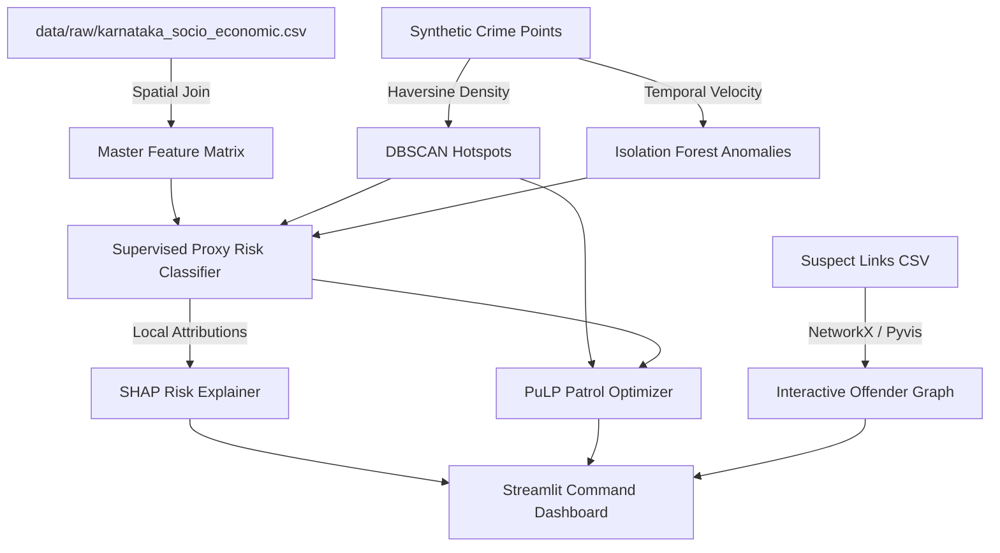

<div align="center">

  <!-- 3D Header Animation / Banner -->
  

  <p align="center">
    
  </p>

  <!-- Badges -->
  <p align="center">
    <a href="https://python.org"></a>
    <a href="https://streamlit.io"></a>
    <a href="https://scikit-learn.org"></a>
    <a href="https://shap.readthedocs.io"></a>
    <a href="https://coin-or.github.io/pulp/"></a>
    
  </p>

  <p align="center">
    <b>Karnataka Police Datathon 2026 • Challenge 02 — Drishti (Predictive Command Console)</b>
  </p>

</div>

---

## 🌌 Overview

Most crime analytics tools generate static heatmaps and stop there—leaving command officers with a critical **Real-Time Crime Center (RTCC) gap**: *they predict, but they don't decide.*

**Drishti** bridges this gap. Built for the Karnataka Police Datathon 2026, Drishti is an interactive, explainable, predictive command console that turns crime predictions into **optimized, actionable patrol unit deployments**.

```

┌─────────────────────────────────────────────────────────────────────────────────────────┐
│                                  DRISHTI ENGINE FLOW                                    │
│                                                                                         │
│   [Raw Crime Points] ──► [DBSCAN Density Clusters] ──► [Isolation Forest Surge Alerts]   │
│                                                                   │                     │
│   [Real Socio-Econ Stats] ──► [Supervised Risk Proxy] ────────────┤                     │
│                                                                   ▼                     │
│   [Patrol Units (N)] ──► [PuLP Optimization Solver] ──► [SHAP Explainable Risk Score]   │
│                                 │                                                       │
│                                 ▼                                                       │
│                [OPTIMIZED PATROL ROUTES & MAP DEPLOYMENT]                               │
└─────────────────────────────────────────────────────────────────────────────────────────┘
```

---

## ⚡ Key Differentiators & Features

| Feature | Description | Technical Implementation |
| :--- | :--- | :--- |
| 🚓 **Patrol Simulator** | *"What-If"* interactive deployment tool. Given $N$ patrol units, computes optimal unit placement maximizing covered crime risk while minimizing response latency. | `PuLP` Integer Linear Programming (Maximal Covering Location Problem) |
| 🧠 **SHAP Explainability** | Every grid risk score ships with a transparent natural language feature attribution breakdown—explaining *why* an area is high risk. | `shap.TreeExplainer` on Random Forest proxy model |
| 📊 **Real Socio-Economic Overlay** | Merges district open government statistics (unemployment, literacy, poverty, liquor density) with crime incident points. | Karnataka district CSV + Pandas spatial aggregation |
| 🌐 **Offender Network Graph** | Interactive visualization of criminal networks, shared MO signatures, and suspect co-offending linkages—without controversial facial recognition. | `Pyvis` + `NetworkX` physics-enabled graph |
| 📍 **Spatial Density & Surges** | Automatic spatial crime cluster identification and spatio-temporal surge anomaly detection. | `DBSCAN` (Haversine metric) + `Isolation Forest` |

---

## 🏗️ System Architecture



---

## 🛠️ Technology Stack

```

┌─────────────────────────────────────────────────────────────────────────┐
│ CORE STACK                                                              │
│                                                                         │
│   Frontend & Dashboard   : Streamlit · Folium · Plotly Express · Pyvis  │
│   Machine Learning       : Scikit-learn · DBSCAN · Isolation Forest    │
│   Explainable AI         : SHAP (SHapley Additive exPlanations)         │
│   Optimization Engine    : PuLP (CBC Solver) / SciPy                    │
│   Data Engineering       : Pandas · NumPy                              │
│   Data Sources           : KSP Crime Data 2022 (real) · Karnataka SES  │
└─────────────────────────────────────────────────────────────────────────┘
```

---

## 🚀 Quick Start & Installation

### Prerequisites
* Python 3.10+
* Git

```bash
# 1. Clone the repository
git clone https://github.com/Madhan310301/Drishti.git
cd Drishti

# 2. Create and activate a virtual environment
python -m venv venv
# On Windows:
venv\Scripts\activate
# On Linux/macOS:
source venv/bin/activate

# 3. Install required packages
pip install -r requirements.txt

# 4. Generate socio-economic data (Karnataka district indicators)
python -m data.socio_economic_data

# 5. Build DBSCAN hotspot clusters + anomaly cells
python -m backend.ml.hotspots
python -m backend.ml.anomalies

# 6. Launch the backend API (serves data, optimizer, maps, SHAP)
python -m uvicorn backend.api.main:app --host 127.0.0.1 --port 8000

# 7. In a second terminal, launch the Streamlit Command Console
streamlit run app/app.py
```

> The dashboard opens at http://localhost:8501. The backend API runs at http://127.0.0.1:8000.

---

## 📂 Project Structure

```

Drishti/
├── data/
│   ├── raw/
│   │   ├── crime/karnataka_crime_2022.csv   # REAL KSP crime totals (2022)
│   │   └── karnataka_socio_economic.csv      # District indicators (literacy, unemployment, ...)
│   ├── processed/
│   │   ├── hotspot_centers.csv               # DBSCAN cluster centers (coords + risk)
│   │   └── grid_with_anomalies.csv           # Isolation Forest anomaly flags
│   └── output/
│       ├── hotspot_map.html                  # Folium hotspot map
│       ├── offender_network.html             # PyVis criminal network graph
│       └── shap_explanations.json            # SHAP explanations
├── backend/
│   ├── api/
│   │   ├── main.py                           # FastAPI app + static mounts
│   │   ├── routes.py                         # API endpoints
│   │   └── schemas.py                        # Pydantic response models
│   ├── ml/
│   │   ├── hotspots.py                       # DBSCAN spatial clustering engine
│   │   ├── anomalies.py                      # Isolation Forest surge anomaly detector
│   │   ├── explainability.py                 # Supervised risk proxy + SHAP explainer
│   │   ├── patrol_optimizer.py               # PuLP patrol deployment optimization solver
│   │   ├── network_graph.py                  # PyVis offender network builder
│   │   └── hotspot_map.py                    # Folium hotspot map builder
│   ├── etl/
│   │   └── config.py                         # Data/path configuration
│   └── common/                               # Logger, helpers, constants
├── app/
│   └── app.py                                # Main Streamlit Command Console UI
├── tests/
│   ├── test_features.py                     # Feature tests
│   └── test_manual_checklists.py            # Manual "done" checklist tests
├── DATA_CONTRACTS.md                         # Team API & Data schema contract
├── requirements.txt                         # Dependencies
└── README.md
```

---

## 👥 Team Matrix & Roles

| Member | Role | Key Output / Module |
| :--- | :--- | :--- |
| **Madhan** | **Team Leader** | Git Repo Architecture, Integration Testing, Cloud Deployment, Demo Video |
| **Sai Ram** | **Data Engineer** | Socio-Economic Data, Synthetic Crime Points, Spatial Join Pipeline |
| **Vijay** | **ML Engineer** | DBSCAN Hotspots (`hotspots.py`), Isolation Forest (`anomalies.py`), SHAP Explainer |
| **Kalyan** | **Optimization Engineer** | PuLP Patrol Simulator Engine (`patrol_optimizer.py`), Coverage Metrics |
| **Jenifa** | **Frontend Developer** | Streamlit Dark Command UI (`app.py`), Folium Maps, SHAP Panels, Pyvis Network Graph |

---

## ⏱️ Submission Deadline

* **Final Hackathon Submission**: `26th July 2026, 08:00 PM IST`

---

<div align="center">
  <sub>Built with ❤️ for Karnataka Police Datathon 2026 by Team Madhan, Sai Ram, Vijay, Kalyan & Jenifa.</sub>
</div>
